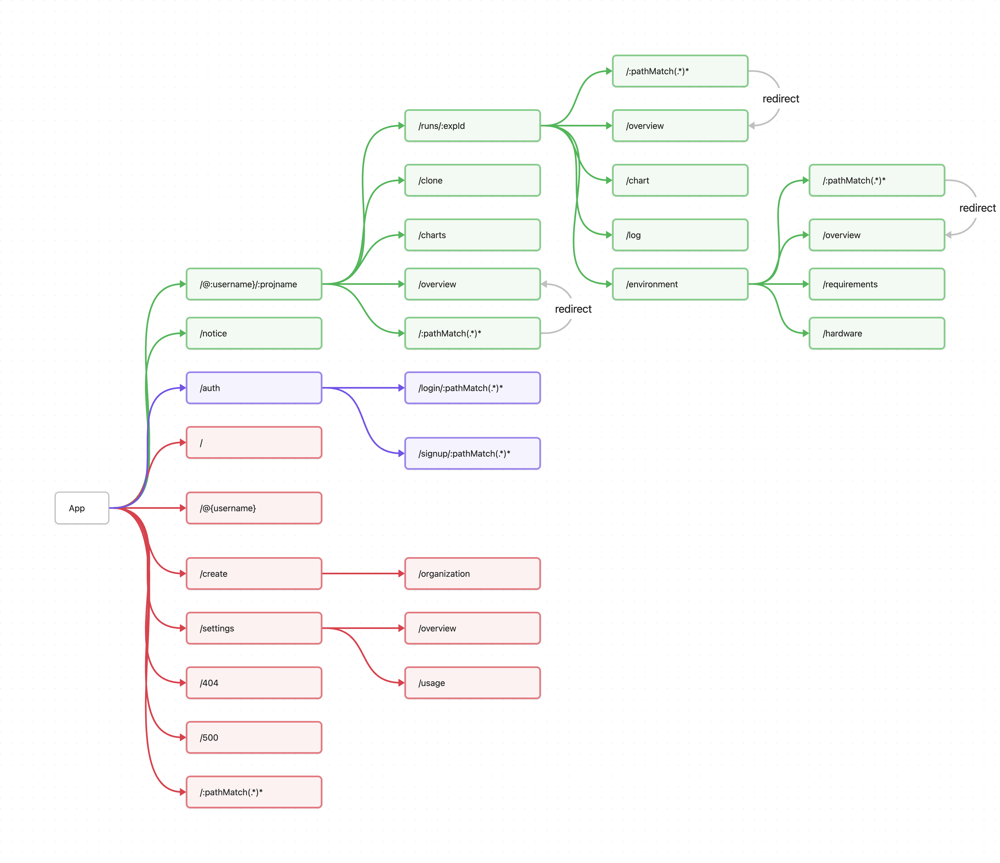

# SwanLab-Core-App

SwanLab前端核心模块，app基座。

## 开发IDE、依赖和启动项目

项目开发IDE为[Webstorm](https://www.jetbrains.com/webstorm/)，node.js版本为20.17.0，npm版本为默认版本，项目使用npm为包管理工具。

- [swanLab-app-components](https://github.com/SwanHubX/SwanLab-App-Components)：共享组件库
- [react](https://zh-hans.react.dev/learn)：前端框架
- [Next.js](https://nextjs.org/docs)：react的SSR框架
- [next-intl](https://next-intl-docs.vercel.app/)：next框架下的文本国际化插件
- [ahooks](https://ahooks.js.org/zh-CN/)：一套高质量可靠的 React Hooks 库
- [axios](https://axios-http.com/docs/intro)：前端网络请求库
- [shadcn](https://ui.shadcn.com/docs)：前端UI库
- [tailwindcss](https://tailwindcss.com/docs)：前端样式库
- [classnames](https://jedwatson.github.io/classnames/)：前端样式类名处理工具
- [prettier](https://prettier.io/docs/en/index.html)：代码格式化工具
- [eslint](https://eslint.org/docs/user-guide/getting-started)：代码检查工具

### 开发环境启动项目

> ⚠️ 启动项目相关配置还在完善，在此之前只需要`npm install`安装依赖，运行`npm run dev`启动项目即可。

如果需要使用完整的项目功能，请按照以下步骤进行

1. 确保本机环境已经安装[Node.js](https://nodejs.org/zh-cn/)，版本为20.17.0
2. 确保本机已安装docker
3. 确保[SwanLab-Cloud](https://github.com/SwanHubX/SwanLab-Cloud)项目已经能启动，端口号为5177 
4. 确保[Next-Login](https://github.com/SwanHubX/Next-Login)项目已经能启动，端口号为3002
5. 运行`npm install`安装依赖，运行`npm run dev`启动项目，端口号为3001
6. 在本项目`/dev`目录下运行`docker-compose up`启动网关，端口号为8080

## 微前端实现

从微应用的角度出发，我们应该将各个模块分割为不同的项目单独维护、部署，通过路由展示。next.js的rewrites只能用作单页面应用的路由重定向，无法实现微应用的目标。
因此理想情况下，会将一些需要解耦的模块分割为不同项目，通过路由区分，这样可以减少单个项目的复杂度，提高开发效率。

但是问题在于历史上我们使用的大多数框架为vue，因此如果需要实现微应用的目标，需要后端网关的介入，详见[mirco-frontend](https://github.com/SAKURA-CAT/micro-frontend)。
此外，为了避免初始化时的请求开销，需要使用sessionStorage缓存用户信息。

因此一些共享的模块，如header组件、全局主题样式、语言切换函数和sessionStorage信息传递函数等，通过npm包的方式引入，存放在[SwanLab-App-Components](https://github.com/SwanHubX/SwanLab-App-Components)仓库中。

### cookie传递

对于一些用户自定义选项，如果语言、深色模式等，一方面next.js需要在服务端渲染时获取到这些信息，另一方面也需要在不同的项目间传递，因此需要使用cookie传递。

目前所使用到的前端设置cookie如下：

| key             | value               | description |
|-----------------|---------------------|-------------|
| NEXT_LOCALE     | zh, en              | 语言设置        |
| NEXT_COLOR_MODE | dark, light, system | 深色模式设置      |

相关方法存储在[SwanLab-App-Components](https://github.com/SwanHubX/SwanLab-App-Components)仓库中。

## 项目结构划分

在实际生产中会将项目划分为多个模块，每个模块单独维护，通过路由区分，路由图如下图所示，
红色为[core-app](https://github.com/SwanHubX/SwanLab-Core-App)，
绿色为[cloud](https://github.com/SwanHubX/SwanLab-Cloud)，
紫色为[next-login](https://github.com/SwanHubX/Next-Login)：

其中不同模块通过后端网关完成分发。

